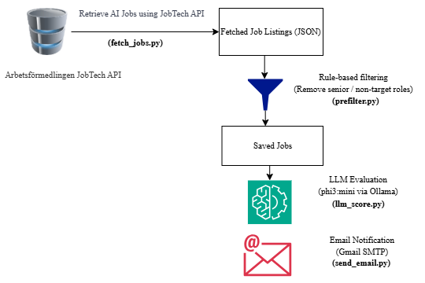

# AI Workflow for Job Search

# Overview

Job seekers often spend a lot of time reading job descriptions to check if a job is a good match. This becomes difficult when there are many job postings every day. This project is an AI-based system that helps candidates find relevant jobs more easily.

The system fetches related job postings (AI roles in my case), filters out irrelevant roles, evaluates the remaining jobs using a local AI model, and sends the best matches by email.

My goal in building this project is to:

- learn how AI systems can automate tasks
- practice building an AI workflow
- help with my own job search
- build a practical portfolio project

# How the System Works

The system runs once per day (6:30 PM) using **Windows Task Scheduler** and follows these steps:

1. Fetch jobs related to AI from **Arbetsförmedlingen (Swedish Employment Service)** using the JobTech API.
2. Save the job data locally.
3. Apply a simple rule-based filter to remove irrelevant roles.
4. Send each remaining job to a local LLM (**phi3:mini**) for evaluation.
5. Score the job based on relevance to my profile.
6. Send the best job matches by email.

# Architecture

To better understand how the system works, see the diagram below.

# Example Email Output

The system sends a daily email with a summary of the analysed jobs and the jobs that match the candidate profile.

Screenshot:

# Project Structure

# Project Structure
File structure of the project 

- data/                # stored job data
- fetch_jobs.py        # fetch jobs from API
- prefilter.py         # rule-based filtering
- llm_score.py         # LLM evaluation logic
- score_today.py       # scoring pipeline
- send_email.py        # email notification
- main.py              # run full workflow
- requirements.txt
- README.md

# Technologies Used

- Python
  
- Ollama
  
- Phi-3 Mini (local LLM)
  
- Gmail SMTP
  
- JobTech API (Arbetsförmedlingen)

# Setup

To Install dependencies:

pip install -r requirements.txt

# Environment Variables

Create a .env file with the following fields

GMAIL_SENDER=your_email@gmail.com

GMAIL_RECEIVER=your_email@gmail.com

GMAIL_APP_PASSWORD=your_gmail_app_password

# Runnig the System

To Run the full workflow, run the script
- python main.py

This will:

1. fetch jobs

2. filter jobs

3. evaluate jobs using the LLM

4. send email with job matches

# Possible Future Improvements

Some ideas for future versions:

- Convert the workflow into a true AI agent using **LangGraph**
- Add a web dashboard
- Add job application tracking
- Add support for multiple job sites

